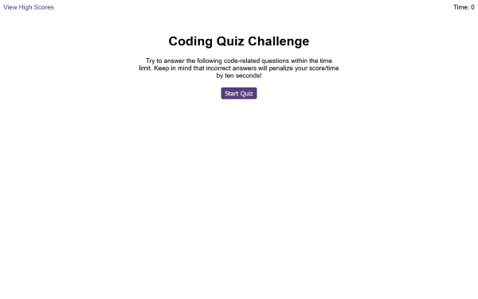

# Coding-Quiz
A multiple choice quiz created using javascript

## A quiz about JavaScript made using JavaScript

This project has been created to demonstrate using the DOM to manipulate HTML and CSS thus creating a fun interactive education game. JavaScript functions and event listeners are used along with localstorage to store high scores.

## Usage

View on GitHub Pages here: [https://webtam81.github.io/Coding-Quiz/](https://webtam81.github.io/Coding-Quiz/) and follow the instructions on-screen to play the game!

## License

MIT License. See license file for further details.